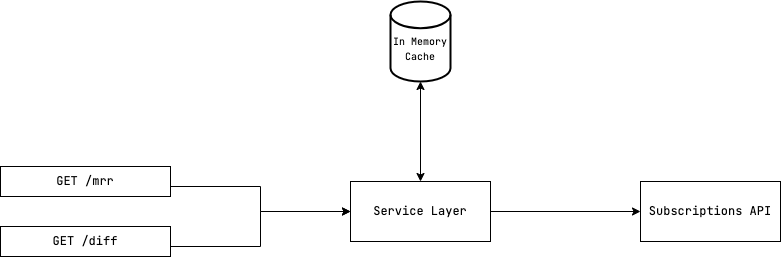

## Introduction:
MRR is a critical key performance indicator (KPI) for any SaaS company. In this design document, we'll look at how we can use the Subscription API to gather and calculate the MRR.

## Problem Statemnt:
Riot offers its clients a variety of subscription plans based on the number of workers and the billing period type they select. for the case of the case of the case of the cases of the cases of the cases of the cases of the cases of the cases of the cases of the cases of the cases of the cases of the cases of the cases of the cases of the cases for. A subscription also has a `status` field that indicates whether the contract is `active` or `canceled`, among other things. The subscription document also includes a field called "interval" that specifies whether the client chose a yearly or monthly billing option. Making an HTTP `GET` request to the given endpoint will yield this info. In this design document, we will look at how to obtain the MRR for a specific month as well as the evolution of the MRR from one month to the next for a specific subscrption given it's ID. We also need to take into account the currrency of each subscription as it might be difference from one another

## Requirements:
- The API should be in form of an HTTP REST API
- The API should have an endpoint for querying the MRR of given month.
- The API should have an endpoint for querying the evolution of the MRR of given month compared to the previous month for a specific subscription

## Assumptions:
- The Subscription API does not have a rate limiter
- The Subscription API will cycle between the following mounths : Jan 22, Feb 22, Mar 22 periodicly
- The Subscritions API data will not change ovetime for given month
- The currency used in the subscrption API is USD, EUR
- The excahnge rate is fixed for USD to EUR is 1.08 and from USD to EUR is : 0.93 

## The proposed solution:
To gather and compute the MRR for a given month, we must first collect the list of subscriptions that are active for that month. However, because the Subscriptions API repeats the same answer for the months of January 22, February 22, and March 22, we can make three requests to gather all the information we require. This information can then be kept in an in-memory cache, such as reddis or memcache, but for the purposes of this problem and because the amount of data isn't too large, we'll just use a simple (key, value) `Map` in Typescript. We can calculate the MRR using this data, but first we must filter the response to only retain the active subscriptions. The next step is to sum the result of the product of `unit_amount` and `quantity` as we iterate through the subscription's elements. Divide this amount by the relevant factor. For monthly subscriptions, the factor will be 1, and for `yealy` subscriptions, it will be 12. We need to also take off the percentage described by the `off_pourcentage`. Depending on the currency of the billing of each subscription we need to tranform the We can store this information as it will be useful for use to compute the evolution of the MRR of a given month compared to the previous one. The diagram below have a high level the design of the solution :



## Implementation:
The API is RESTful API with two endpoints :
### MRR API :
- Path : `/mrr`
- Query Params :
	- `month` -> `string` / the month for which we want to get the MRR 
	- `currency` -> `[USD, EUR]` / the currency of the result
- Return : 
```
{
	"total": number,
	"currency": string
}
```

### Difference MRR API :
- Path : `/diff`
- Query Params :
	- `month` -> `string` / the month for which we want to get the MRR for.
	- `subscriptionId` -> `string` / The specific subscriptionId we want to get the subscription for
	- `currency` -> `[USD, EUR]` / the currency of the resulted MRR
- Return : 
```
{
	"total": number, 
	"currency": string
}

## Technical Stack:
- Node & PNPM
- Typescript
- Hono for server (honojs.dev)
- Vitest / Supertest for testing
